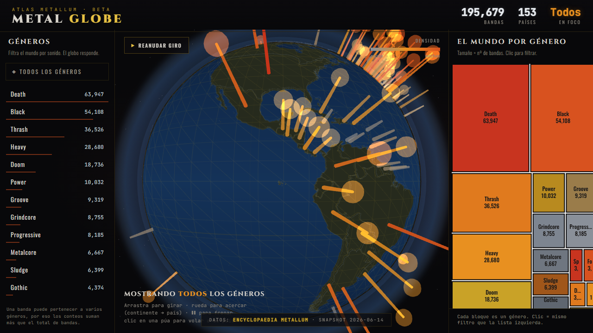

# 🤘 Atlas Metallum

Dashboard web que mapea las bandas de metal del mundo a partir de
**[Encyclopaedia Metallum](https://www.metal-archives.com/)** (The Metal Archives):
un **globo 3D navegable** con una púa por país (altura = nº de bandas), **filtro
bidireccional por género**, **treemap** de géneros y **ficha por país** con
bandas emblemáticas (enlazadas a MA), géneros dominantes y ciudades.

100% estático (HTML + JS + un JSON). El pipeline de datos es Python.



---

## 🌍 El globo: zoom progresivo

- **Planetario** — globo girando, una púa por país, fronteras reales sutiles.
- **Continental** — al acercar (rueda), aparecen los nombres de países y las
  fronteras se intensifican.
- **País** — clic en una púa → la cámara **vuela** y centra el país, abre su
  ficha. Botón **“Vista planetaria”** para volver.

Las fronteras se cargan de un TopoJSON real ([world-atlas](https://github.com/topojson/world-atlas)
`countries-110m`) proyectado sobre la esfera — no son coordenadas inventadas.

---

## 🔌 La fuente de datos (importante)

Metal Archives **no tiene API oficial**, pero su web sirve las tablas con
endpoints AJAX que devuelven JSON limpio. **Hoy el sitio está protegido por un
Cloudflare Turnstile (managed challenge)**: `requests`/`curl_cffi` reciben 403, y
un navegador *headless* normal queda atrapado en “Just a moment…”.

La forma que **sí** funciona, de manera repetible: **[Scrapling](https://github.com/D4Vinci/Scrapling)
+ Camoufox** (un Firefox *stealth*). Se abre el navegador, **un humano hace clic
una vez** en el checkbox de Cloudflare, y en esa **misma sesión caliente** se
barren todos los países sin volver a ser desafiado.

> ⚠️ Por ese clic humano, **el scraping corre LOCAL, no en GitHub Actions**
> (un runner sin display no puede pasar el Turnstile). Reusar solo la cookie en
> otro proceso tampoco sirve: Camoufox genera un fingerprint nuevo por lanzamiento
> y Cloudflare lo rechaza. Por eso: una sola sesión, clic al inicio, barrido seguido.

**“Actualizar” = volver a correr el barrido local** (snapshot más nuevo) y
regenerar el JSON. La metadata agregada cambia poco, así que mensual basta.

---

## 🗂️ Estructura

```
Metallum/
├── scraper/
│   ├── ma_session.py        # sesión Camoufox: clic 1 vez + rate-limit + cache + backoff
│   ├── paises.py            # lista ISO+nombre desde /browse/country
│   ├── scrape_paises.py     # barrido por país → data/bands_raw.csv   (FASE 1)
│   ├── parse_generos.py     # género libre → géneros raíz + subgéneros
│   ├── geocode.py           # centroides de país (lat/lng)
│   ├── build_atlas_json.py  # ensambla → web/data/atlas_data.json
│   └── _archive_live_scraping/   # intentos previos (requests/Playwright) — referencia
├── data/
│   ├── cache/               # JSON crudo cacheado (NO sube al repo)
│   ├── paises.json          # lista de países (sí sube)
│   └── bands_raw.csv        # bandas crudas (regenerable; no sube)
├── web/
│   ├── index.html           # el front (globo + treemap + fichas)
│   └── data/atlas_data.json # lo que el front consume
└── .github/workflows/deploy.yml   # publica web/ en GitHub Pages
```

---

## 🚀 Cómo correrlo

### 1. Instalar dependencias
```bash
py -3 -m pip install -r requirements.txt
py -3 -m playwright install chromium   # (sólo para verificación del front)
py -3 -m camoufox fetch                # navegador stealth para el scraper
```

### 2. Barrer Metal Archives (LOCAL, con tu clic)
En tu terminal interactivo (en Claude Code, antepón `!`):
```bash
py -3 scraper/scrape_paises.py            # todos los países
# o un smoke test de un país:
py -3 scraper/scrape_paises.py --solo PE
```
Se abre una ventana de **Firefox (Camoufox)**. Si aparece *“Verify you are
human”*, haz **un clic** en el checkbox. Deja la ventana abierta: el barrido
corre solo, con delays de 1.5–3 s y cache en disco (es **reanudable**: si se
corta, vuelves a correrlo y retoma donde quedó). Salida → `data/bands_raw.csv`.

### 3. Construir el JSON del front
```bash
py -3 scraper/build_atlas_json.py         # → web/data/atlas_data.json
```

### 4. Ver el dashboard
```bash
py -3 -m http.server -d web 8000
# abre http://localhost:8000
```

---

## 🌐 Publicar (GitHub Pages)

El sitio es estático. El workflow `.github/workflows/deploy.yml` publica la
carpeta `web/` en GitHub Pages en cada push a `main` (y manualmente con
*Run workflow*). Para activarlo: en el repo, **Settings → Pages → Source:
GitHub Actions**. La URL queda como `https://<usuario>.github.io/<repo>/`.

> El workflow **no scrapea** (no puede pasar el Turnstile sin display); solo
> publica el `web/` que ya contiene el `atlas_data.json` generado localmente.
> Flujo de actualización: corres el scraper local → `build_atlas_json.py` →
> commit del nuevo `atlas_data.json` → push (Pages se redespliega solo).

---

## 🧬 Parsing de géneros

El campo género de MA es texto libre compuesto (`Symphonic Black Metal/Folk Metal`,
`Black Metal (early); Ambient (later)`, `Doom/Death Metal`). `parse_generos.py`:
quita notas temporales `(early)/(later)`, separa por `,` `/` `;`, y mapea cada
token a un **género raíz** por su palabra de cabeza (`Symphonic Black → Black`,
`Melodic Death → Death`). Una banda puede contar en varias raíces.

Raíces: Black, Death, Thrash, Heavy, Power, Doom, Speed, Folk, Symphonic,
Progressive, Grindcore, Sludge, Gothic, Groove, Industrial, Metalcore, Deathcore.

---

## 📦 Contrato de datos (`web/data/atlas_data.json`)

`ciudades` y `top_bandas` se emiten como **objetos** (no strings):
`ciudades: [{nombre, bandas}]`, `top_bandas: [{nombre, id, genero, ma_url, roots}]`.
El front lee `.nombre` y usa `ma_url` para enlazar a la banda en MA.
`top_bandas` sin enriquecer usa como proxy el `band_id` ascendente (IDs bajos =
bandas registradas antes en MA = típicamente las clásicas del país).

Para que la ficha respete el filtro de género de forma exacta, cada país lleva
además `g_ciudades: { Género: [{nombre, bandas}] }` (top ciudades por género) y
cada banda lleva `roots` (sus géneros raíz). Así, al filtrar por un género, la
ficha muestra el conteo, las bandas y las ciudades de **ese** género. Nota: como
una banda puede tener varios géneros, la suma de `g{}` supera al `total`.

---

## 🙏 Atribución

Datos: **Encyclopaedia Metallum — The Metal Archives** (metal-archives.com), sitio
comunitario sin fines de lucro. El scraper respeta sus tiempos (delays, cache,
backoff). Banderas: [flagcdn.com](https://flagcdn.com). Fronteras: world-atlas.
