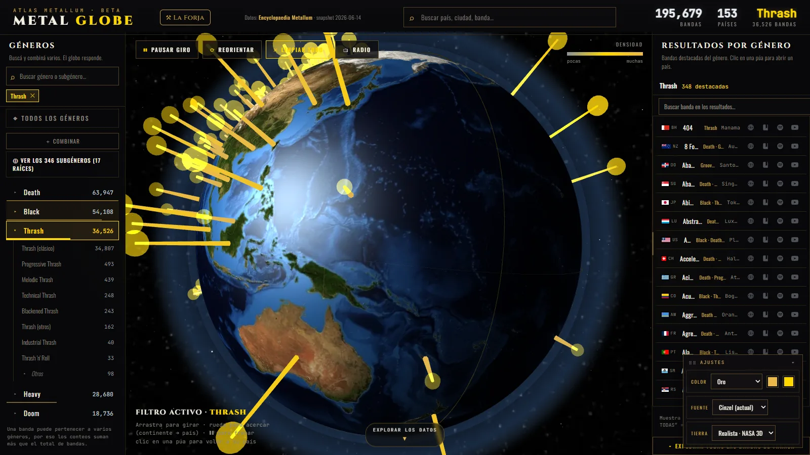

# 🤘 Metal Globe

A navigable 3D globe with one spike per country (height = number of bands),
bidirectional genre filtering, a genre treemap, and per-country sheets — built
from **[Encyclopaedia Metallum](https://www.metal-archives.com/)** (The Metal
Archives) data: 195,679 bands across 153 countries.

100% static frontend (HTML + vanilla JS + one JSON file, three.js for the
globe, ECharts for the treemap). The scraping/data pipeline is Python and
runs locally, not in CI.



**Live demo:** [ichisieben.dev/metal-globe/](https://ichisieben.dev/metal-globe/)
(per this project's entry in the [portfolio site metadata](https://github.com/IchiSieben/portfolio-landing)).
The repo also ships a GitHub Pages workflow (`.github/workflows/deploy.yml`)
that publishes `web/` on push to `main`; enable it under **Settings → Pages →
Source: GitHub Actions** to get a `https://<user>.github.io/<repo>/` URL.

Status: **live / usable** — shipped, not actively iterated. See
[`METAL_GLOBE_IMPROVEMENTS.md`](METAL_GLOBE_IMPROVEMENTS.md) for open
proposals (bidirectional genre×country filter, splitting `app.js`).

---

## The globe: progressive zoom

- **Planetary** — the globe rotates, one spike per country, subtle real borders.
- **Continental** — zoom in (scroll wheel) and country names appear, borders
  sharpen.
- **Country** — click a spike → the camera flies in and centers the country,
  opening its sheet. A "Planetary view" button returns you to the top level.

Borders come from a real TopoJSON file ([world-atlas](https://github.com/topojson/world-atlas)
`countries-110m`) projected onto the sphere — not invented coordinates.

---

## How to run it

Verified locally: it's a static site, so any static file server works. No
build step.

```bash
py -3 -m http.server -d web 8000
# open http://localhost:8000
```

Confirmed serving `index.html`, `app.js`, `data.js`, `styles.css` and
`data/atlas_data.json` with `200` from that server. Opening `web/index.html`
directly from disk (`file://`) will fail the `fetch()` call for the JSON data
— always serve it over HTTP.

To also verify the front end headlessly, the repo's own tooling uses
Playwright:

```bash
py -3 -m pip install -r requirements.txt
py -3 -m playwright install chromium
```

---

## Structure

```
Metallum/
├── scraper/
│   ├── ma_session.py        # Camoufox session: one click + rate-limit + cache + backoff
│   ├── paises.py            # ISO + country name list from /browse/country
│   ├── scrape_paises.py     # per-country sweep → data/bands_raw.csv (PHASE 1)
│   ├── parse_generos.py     # free-text genre → root genres + subgenres
│   ├── geocode.py           # country centroids (lat/lng)
│   ├── build_atlas_json.py  # assembles → web/data/atlas_data.json
│   └── _archive_live_scraping/  # earlier attempts (requests/Playwright) — reference only
├── data/
│   ├── cache/                # raw cached JSON (gitignored)
│   ├── paises.json           # country list (tracked)
│   └── bands_raw.csv         # raw bands (regenerable, gitignored)
├── web/                      # the deployed static site
│   ├── index.html            # markup
│   ├── styles.css            # styles
│   ├── data.js                # pure data-aggregation layer (loaded before app.js)
│   ├── app.js                 # globe, treemap, UI logic (three.js + ECharts)
│   └── data/atlas_data.json   # what the front end consumes
└── .github/workflows/deploy.yml  # publishes web/ to GitHub Pages
```

---

## Data source and licensing (read before reusing)

**Band, genre and city data**: scraped from Encyclopaedia Metallum
(metal-archives.com), a non-profit community site with no official API. As of
this build, its pages sit behind a Cloudflare Turnstile challenge that blocks
plain `requests`/`curl_cffi` (403) and ordinary headless browsers (stuck on
"Just a moment…"). The working, repeatable path documented in
`scraper/ma_session.py`: **[Scrapling](https://github.com/D4Vinci/Scrapling) +
Camoufox** (a stealth Firefox build) — a human solves the Cloudflare checkbox
once, and that same warmed-up browser session sweeps every country without
being challenged again (a fresh browser launch gets a new fingerprint and is
blocked again). This is why the scrape runs as one continuous **local**
session with rate limiting, on-disk caching and backoff, rather than as a
distributed CI job — GitHub Actions has no display for the human click.
"Refreshing the data" means re-running the local sweep and regenerating the
JSON; the code carries no license or reuse grant of its own from Metal
Archives, so treat the scraped dataset as attributed-source data, not as
freely relicensable content.

Other data/assets:
- **Country flags**: [flagcdn.com](https://flagcdn.com).
- **Country borders**: [world-atlas](https://github.com/topojson/world-atlas)
  `countries-110m` (TopoJSON, ISC license).

**Code license**: this repository's code is released under **Apache-2.0**
(see [`LICENSE`](LICENSE)). That license covers the scraper, build scripts and
frontend code — it does not relicense the Metal Archives dataset itself.

---

## Genre parsing

Metal Archives' genre field is free-text and compound (`Symphonic Black
Metal/Folk Metal`, `Black Metal (early); Ambient (later)`, `Doom/Death
Metal`). `scraper/parse_generos.py` strips time notes (`(early)/(later)`),
splits on `,` `/` `;`, and maps each token to a **root genre** by its head
word (`Symphonic Black → Black`, `Melodic Death → Death`). A band can count
under multiple roots.

Roots: Black, Death, Thrash, Heavy, Power, Doom, Speed, Folk, Symphonic,
Progressive, Grindcore, Sludge, Gothic, Groove, Industrial, Metalcore,
Deathcore.

---

## Data contract (`web/data/atlas_data.json`)

`ciudades` and `top_bandas` are emitted as **objects**, not strings:
`ciudades: [{nombre, bandas}]`, `top_bandas: [{nombre, id, genero, ma_url,
roots}]`. The front reads `.nombre` and uses `ma_url` to link out to the band
on Metal Archives. For unenriched entries, `top_bandas` uses ascending
`band_id` as a proxy (low IDs = registered earlier on MA, typically the
country's classic bands).

For the genre filter to be exact on a country sheet, each country also
carries `g_ciudades: { Genre: [{nombre, bandas}] }` (top cities per genre) and
each band carries `roots` (its root genres). Filtering by a genre then shows
the count, bands and cities for *that* genre specifically. Note: because a
band can have several genres, the sum across `g{}` exceeds `total`.

---

## Author

Yoichi Palacios Tanaka (IchiSieben) · [ichisieben.dev](https://ichisieben.dev)

## License

Code: [Apache-2.0](LICENSE). Scraped data: attributed to Encyclopaedia
Metallum, see [Data source and licensing](#data-source-and-licensing-read-before-reusing).

---

# 🤘 Metal Globe (Español)

Un globo 3D navegable con una púa por país (altura = nº de bandas), filtro
bidireccional por género, treemap de géneros y ficha por país — construido a
partir de datos de **[Encyclopaedia Metallum](https://www.metal-archives.com/)**
(The Metal Archives): 195 679 bandas en 153 países.

Frontend 100% estático (HTML + JS vanilla + un JSON, three.js para el globo,
ECharts para el treemap). El pipeline de scraping/datos es Python y corre en
local, no en CI.


**Demo en vivo:** [ichisieben.dev/metal-globe/](https://ichisieben.dev/metal-globe/)
(según la ficha de este proyecto en los [metadatos del portafolio](https://github.com/IchiSieben/portfolio-landing)).
El repo también trae un workflow de GitHub Pages (`.github/workflows/deploy.yml`)
que publica `web/` en cada push a `main`; para activarlo: **Settings → Pages →
Source: GitHub Actions**, lo que deja una URL `https://<usuario>.github.io/<repo>/`.

Estado: **en vivo / usable** — publicado, sin iteración activa. Ver
[`METAL_GLOBE_IMPROVEMENTS.md`](METAL_GLOBE_IMPROVEMENTS.md) para propuestas
abiertas (filtro bidireccional género×país, partir `app.js`).

---

## El globo: zoom progresivo

- **Planetario** — el globo gira, una púa por país, fronteras reales sutiles.
- **Continental** — al acercar (rueda del mouse) aparecen los nombres de los
  países y las fronteras se intensifican.
- **País** — clic en una púa → la cámara vuela y centra el país, abre su
  ficha. Botón "Vista planetaria" para volver.

Las fronteras vienen de un TopoJSON real ([world-atlas](https://github.com/topojson/world-atlas)
`countries-110m`) proyectado sobre la esfera — no son coordenadas inventadas.

---

## Cómo correrlo

Verificado en local: es un sitio estático, así que cualquier servidor de
archivos estáticos funciona. Sin build.

```bash
py -3 -m http.server -d web 8000
# abre http://localhost:8000
```

Confirmado que ese servidor entrega `index.html`, `app.js`, `data.js`,
`styles.css` y `data/atlas_data.json` con `200`. Abrir `web/index.html`
directamente desde disco (`file://`) falla el `fetch()` del JSON de datos —
sirve siempre por HTTP.

Para verificar el front en modo headless, el repo usa Playwright:

```bash
py -3 -m pip install -r requirements.txt
py -3 -m playwright install chromium
```

---

## Estructura

```
Metallum/
├── scraper/
│   ├── ma_session.py        # sesión Camoufox: clic 1 vez + rate-limit + cache + backoff
│   ├── paises.py            # lista ISO+nombre desde /browse/country
│   ├── scrape_paises.py     # barrido por país → data/bands_raw.csv   (FASE 1)
│   ├── parse_generos.py     # género libre → géneros raíz + subgéneros
│   ├── geocode.py           # centroides de país (lat/lng)
│   ├── build_atlas_json.py  # ensambla → web/data/atlas_data.json
│   └── _archive_live_scraping/   # intentos previos (requests/Playwright) — referencia
├── data/
│   ├── cache/               # JSON crudo cacheado (gitignored)
│   ├── paises.json          # lista de países (sí sube)
│   └── bands_raw.csv        # bandas crudas (regenerable, gitignored)
├── web/                     # el sitio estático desplegado
│   ├── index.html           # markup
│   ├── styles.css           # estilos
│   ├── data.js               # capa pura de agregación de datos (se carga antes que app.js)
│   ├── app.js                 # globo, treemap y lógica de UI (three.js + ECharts)
│   └── data/atlas_data.json   # lo que el front consume
└── .github/workflows/deploy.yml   # publica web/ en GitHub Pages
```

---

## Fuente de datos y licencias (leer antes de reusar)

**Datos de bandas, géneros y ciudades**: scrapeados de Encyclopaedia Metallum
(metal-archives.com), sitio comunitario sin fines de lucro y sin API oficial.
Al momento de este build, sus páginas están detrás de un desafío Cloudflare
Turnstile que bloquea tanto `requests`/`curl_cffi` (403) como navegadores
headless normales ("Just a moment…"). La vía que sí funciona, documentada en
`scraper/ma_session.py`: **[Scrapling](https://github.com/D4Vinci/Scrapling)
+ Camoufox** (un Firefox sigiloso) — un humano resuelve el checkbox de
Cloudflare una vez, y esa misma sesión de navegador ya caliente barre todos
los países sin volver a ser desafiada (un lanzamiento nuevo del navegador
genera un fingerprint distinto y vuelve a ser bloqueado). Por eso el barrido
corre como una sola sesión **local** continua, con rate limiting, cache en
disco y backoff, en vez de un job distribuido en CI — GitHub Actions no tiene
pantalla para el clic humano. "Actualizar los datos" significa volver a
correr el barrido local y regenerar el JSON; el código no otorga licencia o
permiso de reuso propio sobre los datos de Metal Archives, así que el dataset
scrapeado debe tratarse como dato con fuente atribuida, no como contenido
relicenciable libremente.

Otros datos/assets:
- **Banderas de países**: [flagcdn.com](https://flagcdn.com).
- **Fronteras de países**: [world-atlas](https://github.com/topojson/world-atlas)
  `countries-110m` (TopoJSON, licencia ISC).

**Licencia del código**: el código de este repositorio se publica bajo
**Apache-2.0** (ver [`LICENSE`](LICENSE)). Esa licencia cubre el scraper, los
scripts de build y el frontend — no relicencia el dataset de Metal Archives.

---

## Parsing de géneros

El campo género de MA es texto libre compuesto (`Symphonic Black
Metal/Folk Metal`, `Black Metal (early); Ambient (later)`, `Doom/Death
Metal`). `scraper/parse_generos.py` quita notas temporales
`(early)/(later)`, separa por `,` `/` `;`, y mapea cada token a un **género
raíz** por su palabra de cabeza (`Symphonic Black → Black`, `Melodic Death →
Death`). Una banda puede contar en varias raíces.

Raíces: Black, Death, Thrash, Heavy, Power, Doom, Speed, Folk, Symphonic,
Progressive, Grindcore, Sludge, Gothic, Groove, Industrial, Metalcore,
Deathcore.

---

## Contrato de datos (`web/data/atlas_data.json`)

`ciudades` y `top_bandas` se emiten como **objetos** (no strings):
`ciudades: [{nombre, bandas}]`, `top_bandas: [{nombre, id, genero, ma_url,
roots}]`. El front lee `.nombre` y usa `ma_url` para enlazar a la banda en
MA. Para bandas sin enriquecer, `top_bandas` usa como proxy el `band_id`
ascendente (IDs bajos = bandas registradas antes en MA = típicamente las
clásicas del país).

Para que la ficha respete el filtro de género de forma exacta, cada país
lleva además `g_ciudades: { Género: [{nombre, bandas}] }` (top ciudades por
género) y cada banda lleva `roots` (sus géneros raíz). Así, al filtrar por un
género, la ficha muestra el conteo, las bandas y las ciudades de **ese**
género. Nota: como una banda puede tener varios géneros, la suma de `g{}`
supera al `total`.

---

## Autor

Yoichi Palacios Tanaka (IchiSieben) · [ichisieben.dev](https://ichisieben.dev)

## Licencia

Código: [Apache-2.0](LICENSE). Datos scrapeados: atribuidos a Encyclopaedia
Metallum, ver [Fuente de datos y licencias](#fuente-de-datos-y-licencias-leer-antes-de-reusar).
